<div class="title-slide-container">
    <div class="title-slide-left">
        <div class="title-slide-logo">
            
        </div>
        <div class="title-slide-title">
            <h1>Cython: Turbodoładowanie Pythona czy zbędna komplikacja?</h1>
        </div>
        <div class="title-slide-accent">
            <h3>2025-03-25</h3>
        </div>
    </div>
    <div>
        <div style="padding: 40px 0 10px 0">
            <h3 class="title-slide-accent">Prezentuje:</h3>
        </div>
        <div>
            
        </div>
        <div>
            
        </div>
        <div class="title-slide-presenter-name">
            <h2>Łukasz Chojnacki</h2>
        </div>
        <div>
            <h3 class="title-slide-accent">Python Developer</h3>
        </div>
    </div>
</div>

<!--

-->

---
---
# whoami

- 🐍 **Python Web Developer** w Deployed.pl.
- 🧑‍🏫 Od wielu lat prowadzę korepetycje z **Pythona** dla osób na różnych poziomach zaawansowania.
- 🧑‍💻 **Cythona** poznałem na studiach i wykorzystałem w swojej pracy magisterskiej. Do przygotowania prezentacji na jego temat zainspirowało mnie pytanie z publiczności podczas niedawego PyKonika.
- ⚽🏴󠁧󠁢󠁥󠁮󠁧󠁿 Poza programowaniem interesuję się **piłką nożną**, szczególnie w wydaniu **angielskim**.

<!--

-->

---
transition: fade-out
---

# Agenda

<ol>
<li><strong>Wprowadzenie do Cythona</strong> – czym jest, jak działa, podstawowa konfiguracja</li>
<li><strong>Optymalizacja kodu Pythona</strong> – wpływ kompilacji, analiza wydajności, statyczne typy</li>
<li><strong>Przyspieszanie obliczeń</strong> – pułapki i wielowątkowość</li>
<li><strong>Ręczna alokacja pamięci</strong> – zarządzanie tablicami i wskaźnikami</li>
<li><strong>Przetwarzanie plików i struktury danych</strong> – operacje na plikach, wydajność vs. wygoda</li>
<li><strong>Kiedy warto, a kiedy nie?</strong> – kluczowe wnioski i najlepsze praktyki</li>
</ol>

---
level: 2
---

# Czym jest Cython?

<div class="w-60 relative">
  <div class="relative w-40 h-40">
    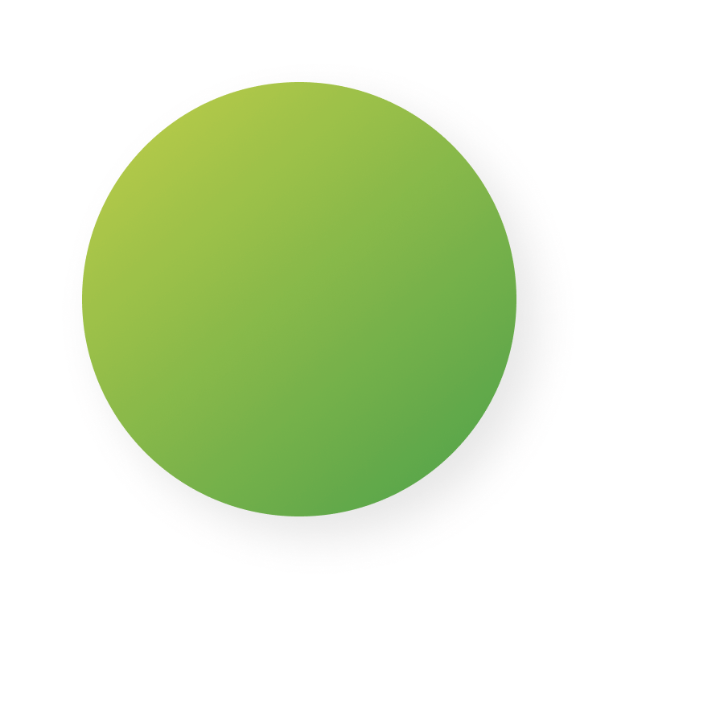
  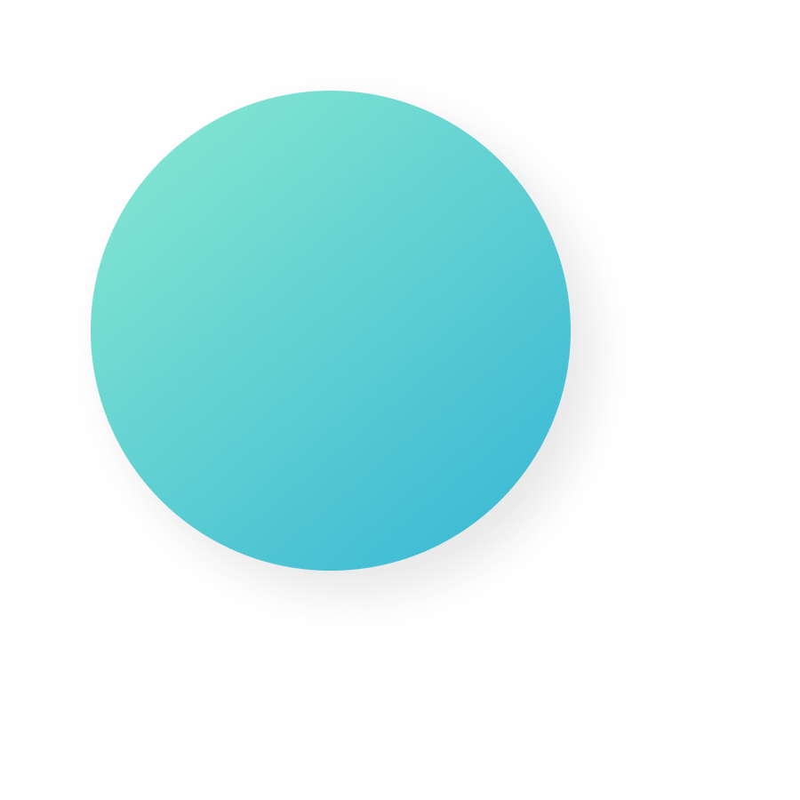
    <div
      v-click
      v-motion
      :initial="{ y: 500, x: -100, scale: 2 }"
      :enter="final_python_text"
      class="absolute inset-0"
      style="z-index: 2; text-align: center; color: black"
    >
      def lambda class continue yield raise
  </div>
    <div
      v-click
      v-motion
      :initial="{ y: 500, x: -100, scale: 2 }"
      :enter="final_cython_text"
      class="absolute inset-0"
      style="z-index: 2; text-align: center; color: black"
    >
      long cdivision malloc libc fopen
  </div>
  </div>
</div>

<div v-click="[5,7]" class="absolute" style="z-index: 10">
    
</div>
<div v-click="[6,7]" class="absolute" style="z-index: 10">
    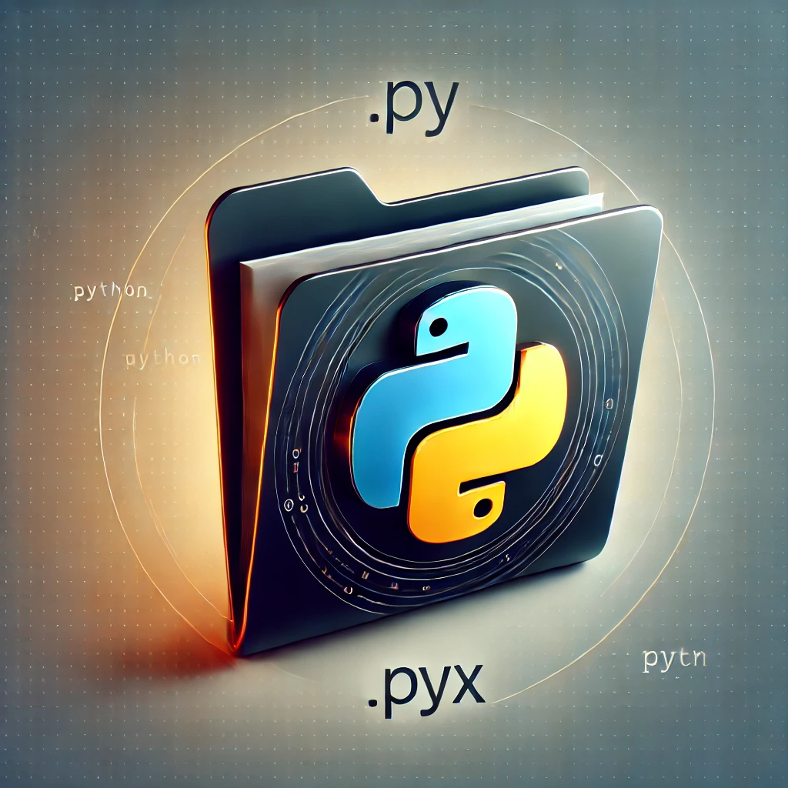
</div>

<!-- vue script setup scripts can be directly used in markdown, and will only affects current page -->
<script setup lang="ts">
const final_python = {
  x: 300,
  y: 100,
  rotate: 0,
  scale: 2,
  transition: {
    type: 'spring',
    damping: 10,
    stiffness: 20,
    mass: 2
  }
};
const final_python_text = {
  x: 270,
  y: 120,
  rotate: 0,
  scale: 1,
  transition: {
    type: 'spring',
    damping: 10,
    stiffness: 20,
    mass: 2
  }
};
const final_cython = {
  x: 350,
  y: 200,
  rotate: 0,
  scale: 4,
  transition: {
    type: 'spring',
    damping: 10,
    stiffness: 20,
    mass: 2
  }
};
const final_cython_text = {
  x: 300,
  y: 300,
  rotate: 0,
  scale: 1.5,
  transition: {
    type: 'spring',
    damping: 10,
    stiffness: 20,
    mass: 2
  }
}
</script>
<!--
* nadzbiór
* 2023 - wydanie wersji 3
* wcześniej pyx, teraz py
* teraz biblioteka, dodatkowe typy, dostęp do funkcji C/C++
* kompilator - dokumentacja każdy Python można skompilować
-->

---

# Jak to działa?


<div v-click>1. Piszesz swoją funkcję 👨‍💻</div>
<div v-click>2. Konfigurujesz plik setup.py ⚙️</div>
<div v-click>3. Kompilator Cythona wytwarza plik C/C++ 🔧</div>
<div v-click>4. Kompilator C/C++ wytwarza plik .so (Unix) lub .pyd (Windows) 🧙‍♂️</div>
<div v-click>5. Skompilowany plik możesz zaimportować w kodzie Pythona 🐍</div>
<div v-click>6. Profit 🚀

</div>

<!--
można pyproject.toml, ale wsparcie jest jeszcze ograniczone
-->

---
layout: center
class: text-center
---

<div>

</div>

---

# Przykładowa funkcja w Pythonie

````md magic-move {lines: true}
```python
def loop(n: int = 10_000_000) -> int:
    result = 0
    for i in range(n):
        result += i
    return result
```
````
<div v-click="[1,2]">Konfigurujemy setup.py:
````md magic-move {lines: true}
```python
from Cython.Build import cythonize
from setuptools import Extension, setup

extensions = [
    Extension("loop.optimized", ["mypackage/loop/optimized.py"]),
]

setup(
    ext_modules=cythonize(extensions, annotate=True),
)
```
````
</div>
<div v-click="2" style="margin-top: -220px">Kompilujemy...</div>
<div v-click="3">Porównujemy wyniki...
```
Running Python version...
49999995000000
Running Cython version...
49999995000000
```
</div>
<div v-click="[4,5]" class="absolute" style="z-index: 10">
    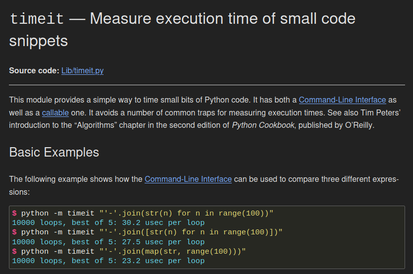
</div>
<div v-click="5">Mierzymy czas...
```
Running Python version...
1 loop, best of 5: 223 msec per loop
Running Cython version...
1 loop, best of 5: 226 msec per loop
```
</div>

<!--
* funkcja pythonowa, suma 10 mln kolejnych liczb
* n(n+1)/2, utrudnione
* setup.py Extension - deklaracja ext w C
* dodatkowe argumenty kompilacji
* `python setup.py build_ext`
* annotate - kilka slajdów dalej
* timeit - import nie jest mierzony, tylko wykonanie
* timeit sam dobiera loops = wiarygodność, szybki powtarza dużo razy
-->

---
layout: center
class: text-center
---

<div>

</div>

<!--
idziemy założyć wątek na SO
-->

---
layout: center
class: text-center
---

<div>
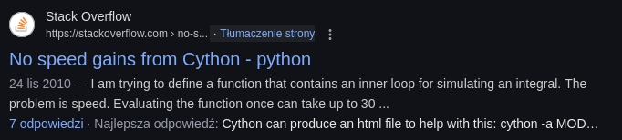
</div>

<!--
* kompilacja != przyspieszenie
* obiekty pythona
* komunikacja z interpreterem
-->

---

# Analiza wydajności

<div>
<Loop1 />
</div>

<!--
* annotate
* biały == 0 interakcji
* interaktywny raport
* deklaracja funkcji
* nagłówek pętli
-->

---

# Make Cython great again!

````md magic-move {at: 1, lines: true}
```python 
def loop(n: int = 10_000_000) -> int:
    result = 0
    for i in range(n):
        result += i
    return result
```

```python {*|1|5|*|*|*|*|*|3-4}
import cython

def loop(n: cython.int = 10_000_000) -> cython.int:
    result: cython.int = 0
    i: cython.int
    for i in range(n):
        result += i
    return result
```

```python
import cython

def loop(n: cython.int = 10_000_000) -> cython.long:
    result: cython.long = 0
    i: cython.int
    for i in range(n):
        result += i
    return result
```
````

<div v-click="[5, 8]">Kompilujemy...</div>
<div v-click="[6, 8]">Porównujemy wyniki...
```
Running Python version...
49999995000000
Running Cython version...
-2014260032
```
</div>

<div v-click="12" style="margin-top: -150px">Kompilujemy...</div>
<div v-click="13">Porównujemy wyniki...
```
Running Python version...
49999995000000
Running Cython version...
49999995000000
```
</div>
<div v-click="14">Mierzymy czas...
```
Running Python version...
1 loop, best of 5: 210 msec per loop
Running Cython version...
20000000 loops, best of 5: 18.3 nsec per loop
```
</div>

<div v-click="[7, 8]">

</div>

<div v-click="[11,12]">
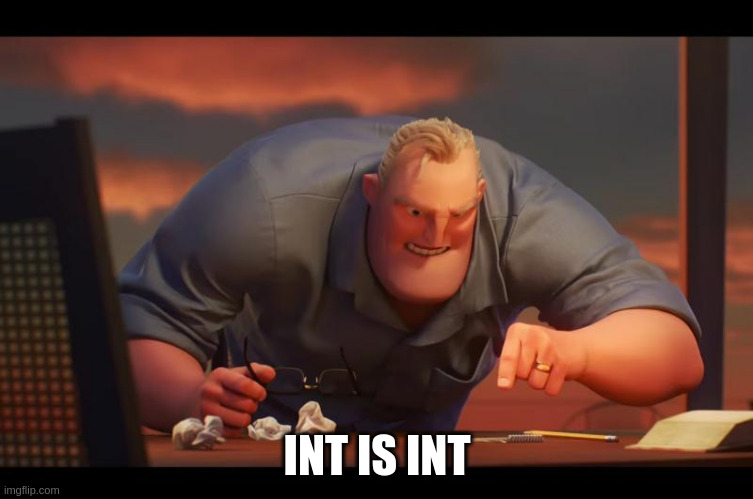
</div>

<div v-click="15">

</div>


<!--
* typy z cythona
* dwie nowe linijki, import i deklaracja zmiennej i
* porównanie wyników -> mem -> clear
* pytanie - co jest źle -> highlight -> long -> mem int is int
-->

---
layout: center
class: text-center
---

<div>

</div>

<!--
* próbujemy wycisnąć więcej
* pytanie - skąd bierzemy pi w pythonie
-->

---

# Przybliżenie liczby π
<div></div>
Czyli wykorzystujemy algorytm z XV wieku, zamiast wykonać `from math import pi`

<div v-click>
<br>Szereg Nilakantha:

$$
3 + \frac{4}{2+3+4} - \frac{4}{4+5+6} + \frac{4}{6+7+8} - \frac{4}{8+9+10} + ... 
$$
</div>

<div v-click>
<br>Przedstawiony za pomocą sumy:

$$
3 + \sum_{n=1}^{\infty} -((-1)^n) \frac{4}{(2*n) * (2*n+1) * (2*n+2)}  
$$
</div>

<!-- 
* zrobimy wolniej i mniej dokładnie
* na przemian dodajemy i odejmujemy
* po uproszczeniu - suma
* da się uprościć jeszcze bardziej, ale na potrzeby przykładu to wystarczy
* pytanie jak zastąpić operator sumy
-->

---

# Przybliżenie liczby π

````md magic-move {at: 1, lines: true}
```python
def pi(loops: int = 999_999) -> float:
    pi_estimate: float = 3.0
    for n in range(1, loops + 1):
        sign: int = -((-1) ** n)
        term = 4 / (2 * n * (2 * n + 1) * (2 * n + 2))
        pi_estimate += sign * term

    return pi_estimate
```

```python{*|3|4|*|*|*|10}
import cython

@cython.cdivision(True)
@cython.cpow(True)
def pi(loops: cython.int = 999_999) -> cython.double:
    pi_estimate: cython.double = 3.0
    n: cython.long
    for n in range(1, loops + 1):
        sign: cython.short = -((-1) ** n)
        term: cython.double = 4 / (2 * n * (2 * n + 1) * (2 * n + 2))
        pi_estimate += sign * term

    return pi_estimate
```

```python
import cython

@cython.cdivision(True)
@cython.cpow(True)
def pi(loops: cython.int = 999_999) -> cython.double:
    pi_estimate: cython.double = 3.0
    n: cython.long
    for n in range(1, loops + 1):
        sign: cython.short = -((-1) ** n)
        term: cython.double = 4.0 / (2 * n * (2 * n + 1) * (2 * n + 2))
        pi_estimate += sign * term

    return pi_estimate
```
````
<div v-click="[5,8]">Kompilujemy...</div>
<div v-click="[6,8]">Porównujemy wyniki...
```
Running Python version...
3.141592653589787
Running Cython version...
3.0
```
</div>
<div v-click="[9,11]" style="margin-top: -150px">Kompilujemy...</div>
<div v-click="[10,11]">Porównujemy wyniki...
```
Running Python version...
3.141592653589787
Running Cython version...
3.141592653589787
```
</div>
<div v-click="11" style="margin-top: -150px; z-index: 999">Mierzymy czas...
```
Running Python version...
1 loop, best of 5: 296 msec per loop
Running Cython version...
20 loops, best of 5: 12.9 msec per loop
```
</div>
<div v-click="12">🚀</div>

<!--
* python -> cythonowe typy
* [hl] cdivision - skip validation (ZeroDivisionError)
* True = 35% szybciej
* [hl] cpow - typ wyniku ** się nie zmienia
* pytanie dlaczego wynik jest zły -> hl
-->

---
layout: center
class: text-center
---

<div>
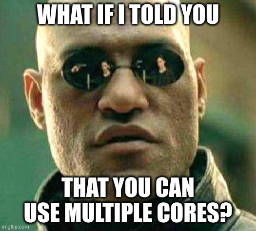
</div>

<!--
ten sam kod, wiele wątków
-->

---

# Przybliżenie liczby π

````md magic-move {at: 1, lines: true}
```python
import cython

@cython.cdivision(True)
@cython.cpow(True)
def pi(loops: cython.int = 999_999) -> cython.double:
    pi_estimate: cython.double = 3.0
    n: cython.long
    for n in range(1, loops + 1):
        sign: cython.short = -((-1) ** n)
        term: cython.double = 4.0 / (2 * n * (2 * n + 1) * (2 * n + 2))
        pi_estimate += sign * term

    return pi_estimate
```
```python
import cython
from cython.parallel import prange

@cython.cdivision(True)
@cython.cpow(True)
def pi(loops: cython.int = 999_999) -> cython.double:
    pi_estimate: cython.double = 3.0
    n: cython.long
    for n in prange(1, loops + 1, nogil=True):
        sign: cython.short = -((-1) ** n)
        term: cython.double = 4.0 / (2 * n * (2 * n + 1) * (2 * n + 2))
        pi_estimate += sign * term

    return pi_estimate
```
````
<arrow v-click="[2,4]" x1="550" y1="180" x2="395" y2="245" color="#953" width="2" arrowSize="1" />

<div v-click="[3,4]">
    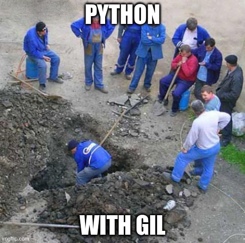
</div>

<div v-click="[4,6]">Kompilujemy...</div>
<div v-click="[5,6]">Porównujemy wyniki...
```
Running Python version...
3.141592653589787
Running Cython version...
3.141592653589787
```
</div>

<div v-click="6" style="margin-top: -150px; z-index: 999">Mierzymy czas...
```
Running Python version...
1 loop, best of 5: 296 msec per loop
Running Cython version...
100 loops, best of 5: 2.75 msec per loop
```
</div>

<div v-click="7">

</div>

<!--
* prange = wątki
* default = tyle co rdzeni, configurable
* kolejność nie ma znaczenia
[click]
* [arrow] wymagany nogil
[click]
* nogil -> dekorator, context manager
* mem robotnicy
[click:3]
* kompilacja wymaga OpenMP + flagi w setup.py
-->

---
layout: center
class: text-center
---

<div
  v-motion
  :enter="{ scale: 2.5 }"
>
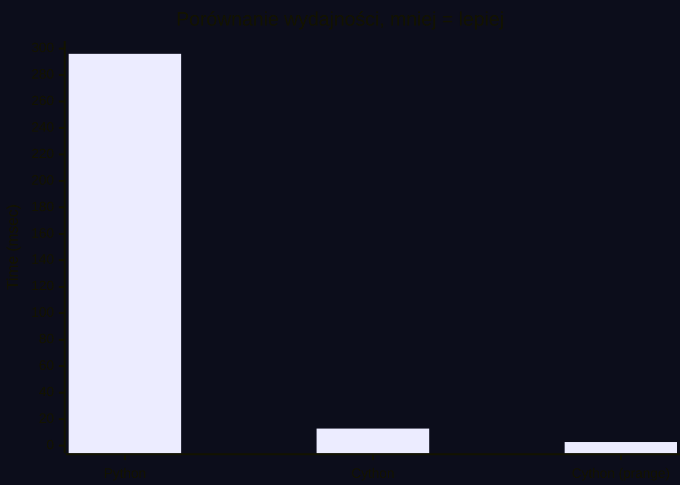
</div>

<!--
* cython ok 23x szybszy
* cython + prange jeszcze 4x
* narzut na tworzenie wątków - przy 15 iteracji prange jest wolniejszy
-->

---
layout: center
class: text-center
---

<div>
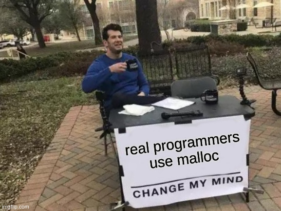
</div>

<!--
pytanie o zagrożenia wykorzystania malloc - wycieki pamięci, brak obsługi błędów (zwraca NULL)
-->

---

# Wykorzystanie `malloc`

````md magic-move {at: 1, lines: true}
```python
def allocation(size: int = 999_999) -> list[int]:
    numbers = [0] * size
    for i in range(size):
        numbers[i] = i * 2
    return numbers
```
```python{*|8|6-9|11-12|19|21|*}
import cython
from cython.cimports.libc.stdlib import malloc, free


def allocation(size: cython.int = 999_999):
    numbers: cython.p_int = cython.cast(
        cython.p_int,
        malloc(size * cython.sizeof(cython.int))
    )

    if not numbers:
        raise MemoryError("Memory allocation failed")

    try:
        i: cython.int
        for i in range(size):
            numbers[i] = i * 2

        return [x for x in numbers[:size]]
    finally:
        free(numbers)
```
````

<!--
symulacja alokacji pamięci - wypełniamy zerami listę długości `size`

następnie tak utworzoną listę wypełniamy kolejnymi liczbami parzystymi

[click] jak ktoś pamięta składnię malloc w C to zauważy tu znajomą składnię

[click] robimy alokację pamięci rozmiaru size * sizeof(int)

[click] wykonujemy cast na typ p_int, czyli wskaźnik na int

[click] powinniśmy ręcznie obsłużyć potencjalny z alokacją

[click] robimy pythonową listę, mniejsza wydajność

[click] obowiązkowo też zwalniamy pamięć
-->

---

# A jak z wydajnością takiego rozwiązania?

<div v-click>
```
Running Python version...
10 loops, best of 5: 33.6 msec per loop
Running Cython version...
10 loops, best of 5: 23.7 msec per loop
```
</div>
<div v-click>

</div>

<!--
[click:2]
* lista zabija wydajność
* kod Cy różni się od Py
* -> więcej różnic
-->

---

# Częstotliwość występowania liter w pliku

````md magic-move {at: 1, lines: true}
```python
import string
from collections import Counter
from pathlib import Path


def lettercount(filename: str = "./data/6mb-text-file.txt"):
    with Path(filename).open("r", encoding="utf-8") as f:
        text = f.read().lower()

    # Filter only lowercase ASCII letters and count them
    letter_counts = Counter(
        letter for letter in text 
        if letter in string.ascii_lowercase
    )

    return dict(letter_counts)
```
```python
import string
from pathlib import Path


def lettercount(filename: str = "./data/6mb-text-file.txt"):
    letter_counts = dict()

    with Path(filename).open("r", encoding="utf-8") as f:
        while True:
            line = f.readline()
            if not line:
                break
            for letter in line:
                if letter.isupper():
                    letter = letter.lower()
                if letter in string.ascii_lowercase:
                    if letter in letter_counts:
                        letter_counts[letter] += 1
                    else:
                        letter_counts[letter] = 1

    return letter_counts
```
```python{*|2,7-9|4,14|22|*}
import cython
from cython.cimports.libc.stdio import fclose, fopen, FILE
from cython.cimports.posix.stdio import getline
from cython.cimports.libcpp.unordered_map import unordered_map

def lettercount(filename: bytes = b"./data/6mb-text-file.txt"):
    f = fopen(filename, b"r")
    if f is cython.NULL: return

    line: cython.p_char = cython.NULL
    l: cython.size_t = 1
    read: cython.Py_ssize_t

    letter_counts: unordered_map[cython.char, cython.int]
    letter: cython.char

    while True:
        {...}

    fclose(f)

    return {chr(key): value for key, value in letter_counts}
```
```python{*|13-14|*}
import cython
from cython.cimports.libc.stdio import fclose, fopen, FILE
from cython.cimports.posix.stdio import getline
from cython.cimports.libcpp.unordered_map import unordered_map

def lettercount(filename: bytes = b"./data/biblia-tysiaclecia.txt"):
    {...}
    while True:
        read = getline(cython.address(line), cython.address(l), f)
        if read == -1:
            break
        for letter in line:
            if 65 <= letter <= 90:
                letter = letter + 32
            if 97 <= letter <= 122:
                if letter_counts.find(letter) == letter_counts.end():
                    letter_counts[letter] = 1
                else:
                    letter_counts[letter] += 1

    fclose(f)

    return {chr(key): value for key, value in letter_counts}

```
````

<!--
* niemożliwy w C
[click]
* nie korzystamy z ficzerów pythona
* 250-300 ms
[click]
* długi kod, zwijamy while
[click]
* fopen znane z C
[click]
* `unordered_map` C++ = dict
[click]
* convert to dict, rozwijamy while
[click:3]
* int, +32 zamiast lower
-->

---

# Częstotliwość występowania liter w pliku

Dane są sortowane alfabetycznie już po zwróceniu z funkcji, aby nie zaburzyć benchmarku

Walidacja wyników:
```
Running Python version...
{'a': 341977, 'b': 84467, 'c': 151037, 'd': 146691, 'e': 318719, 'f': 6232, 'g': 68704, 'h': 45303, 'i': 408257, 
'j': 93793, 'k': 103787, 'l': 83617, 'm': 132526, 'n': 178039, 'o': 284004, 'p': 101724, 'q': 2, 'r': 156178, 
's': 185192, 't': 125342, 'u': 82149, 'v': 95, 'w': 179369, 'x': 31, 'y': 154438, 'z': 242550}
Running Cython version...
{'a': 341977, 'b': 84467, 'c': 151037, 'd': 146691, 'e': 318719, 'f': 6232, 'g': 68704, 'h': 45303, 'i': 408257, 
'j': 93793, 'k': 103787, 'l': 83617, 'm': 132526, 'n': 178039, 'o': 284004, 'p': 101724, 'q': 2, 'r': 156178, 
's': 185192, 't': 125342, 'u': 82149, 'v': 95, 'w': 179369, 'x': 31, 'y': 154438, 'z': 242550}
```

<div v-click>
Pomiary czasowe:

```
Running Python version...
1 loop, best of 5: 271 msec per loop
Running Cython version...
20 loops, best of 5: 18 msec per loop
```
</div>

<!--
fajnie, szybciej, użyję wszędzie
-->

---
layout: center
class: text-center
---

<div>
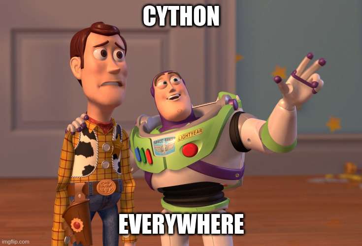
</div>

<!--
pytanie: tak/nie?
-->

---
layout: center
class: text-center
---

<div>
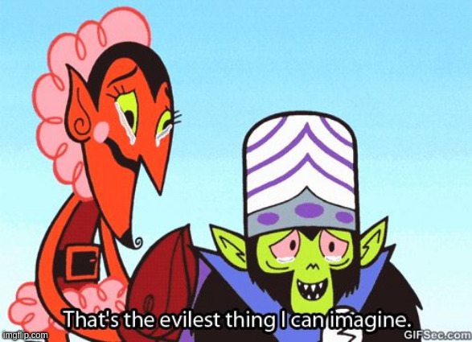
</div>

---

# Kiedy nie warto używać Cythona?

<div v-click>🤷 Kiedy Twój problem nie leży w wydajności Pythona</div>
<div v-click>🐻‍❄️ Kiedy Twój problem można rozwiązać bibliotekami typu numpy/pandas/polars</div>
<div v-click>🐍 Kiedy Twój kod bazuje na algorytmach i strukturach danych wbudowanych w Pythona</div>
<div v-click>🚚 Kiedy Twój program ma być przenośny między systemami operacyjnymi</div>
<div v-click>🐌 Kiedy Twój program nie musi być szybki</div>
<div v-click>⏲️ Kiedy Twój projekt musi być dowieziony szybko</div>

<div v-click><br>Czy zatem warto w ogóle zaprzątać sobie tym głowę?</div>

<div v-click><br>Tak! Jeśli:</div>

<div v-click>🧩 Masz intensywne obliczeniowo operacje, które jesteś w stanie wyizolować bez użycia typów Pythona</div>
<div v-click>⛓️‍💥 Chcesz łatwo zrównoleglić obliczenia bez ograniczeń GIL</div>
<div v-click>🧑‍💻 Chcesz zintegrować się z bibliotekami języka C/C++</div>

<!--

[click]
* 🔨 gwóźdź
* web = sieć, baza, JOINy
* 15ms optymalizacji to mało
* często asyncio
[click]
* są zoptymalizowane, korzystają z C lub Rusta
[click]
* zliczanie liter - dużo dodatkowego kodu, czytelność > wydajność
[click]
* .so lub .pyd
[click]
* narzut, dodatkowa wiedza zespołu, czasami po prostu ma działać
[click]
* często spowolni development
* dużo źródeł `.pyx` a nie `.py`.
[click:3]
* pi
[click]
* ma to swoje ograniczenia


-->

---

# Używasz Cythona już dzisiaj, nawet jeśli o tym nie wiesz
<div></div>
Wiele projektów znanych ze swojej szybkości wykorzystuje Cythona:

<ul>
<li v-click="1">asyncpg</li>
<li v-click="2">uvloop</li>
<li v-click="3">kivy</li>
<li v-click="4">lxml</li>
<li v-click="5">pandas</li>
<li v-click="6">scikit-learn</li>
<li v-click="7">scipy</li>
</ul>

<div>
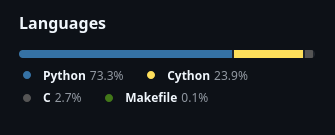
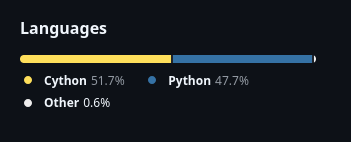
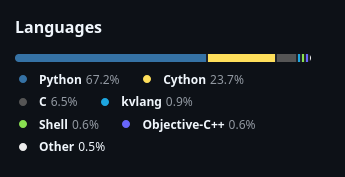
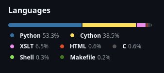
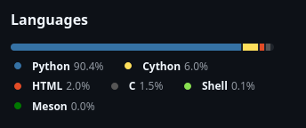
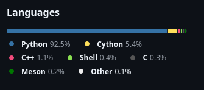
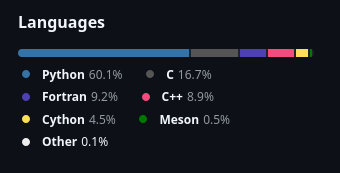
</div>

<!--
* asyncpg
* uvloop
* kivy
* lxml
* pandas
* scikit-learn
* scipy
-->

---

# Czy do pisania kodu w Cythonie potrzebna jest znajomość C?

<div v-click>
Choć nie jest to konieczne, to znajomość C/C++ może być bardzo przydatna przy korzystaniu z Cythona.
Bez znajomości C/C++ można korzystać z Cythona, ale nie można w pełni wykorzystać jego potencjału.
</div>
<div v-click>
Łatwo też wpędzić się w pułapki takie jak dzielenie liczb całkowitych czy przepełnienie typu int.

<div>

</div>
</div>

<!--
Nie, ale się przydaje, są pułapki
-->

---

# Czy programista C może pisać w Cythonie bez znajomości Pythona?

<div v-click>
Praktycznie nie. Cython jest nadzbiorem Pythona, co oznacza, że korzysta z jego składni. Wykorzystanie Cythona 
bez znajomości chociażby podstaw Pythona będzie bardzo trudne.

<div>

</div>
</div>

<!--
Nie, ale Python jest łatwy
-->

---
layout: center
class: text-center
---

# Dzięki za uwagę!


---

<div class="title-slide-container">
    <div class="title-slide-left">
        <div class="title-slide-logo">
            
        </div>
        <div class="title-slide-title">
            <h1>Cython: Turbodoładowanie Pythona czy zbędna komplikacja?</h1>
        </div>
        <div class="title-slide-accent">
            <h3>2025-03-25</h3>
        </div>
    </div>
    <div>
        <div style="padding: 40px 0 10px 0">
            <h3 class="title-slide-accent">Prezentuje:</h3>
        </div>
        <div>
            
        </div>
        <div>
            
        </div>
        <div class="title-slide-presenter-name">
            <h2>Łukasz Chojnacki</h2>
        </div>
        <div>
            <h3 class="title-slide-accent">Python Developer</h3>
        </div>
    </div>
</div>

<!--

-->

---

# Źródła

* https://cython.readthedocs.io/
* Kurt W. Smith - _"Cython. A guide for Python programmers"_, O’Reilly Media,Inc., 2015
